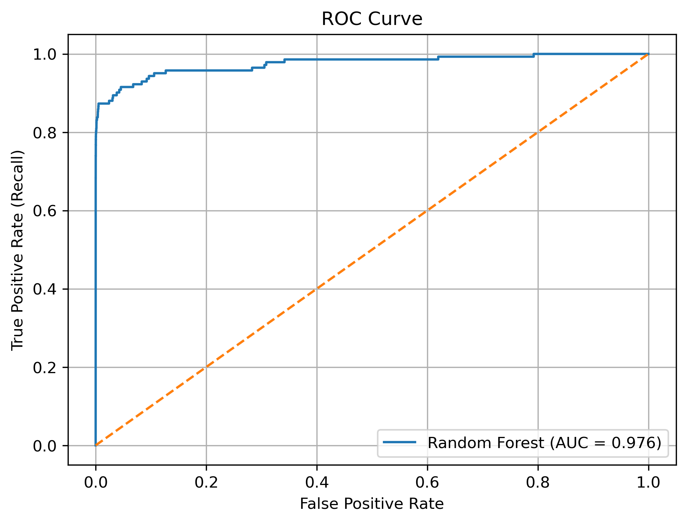
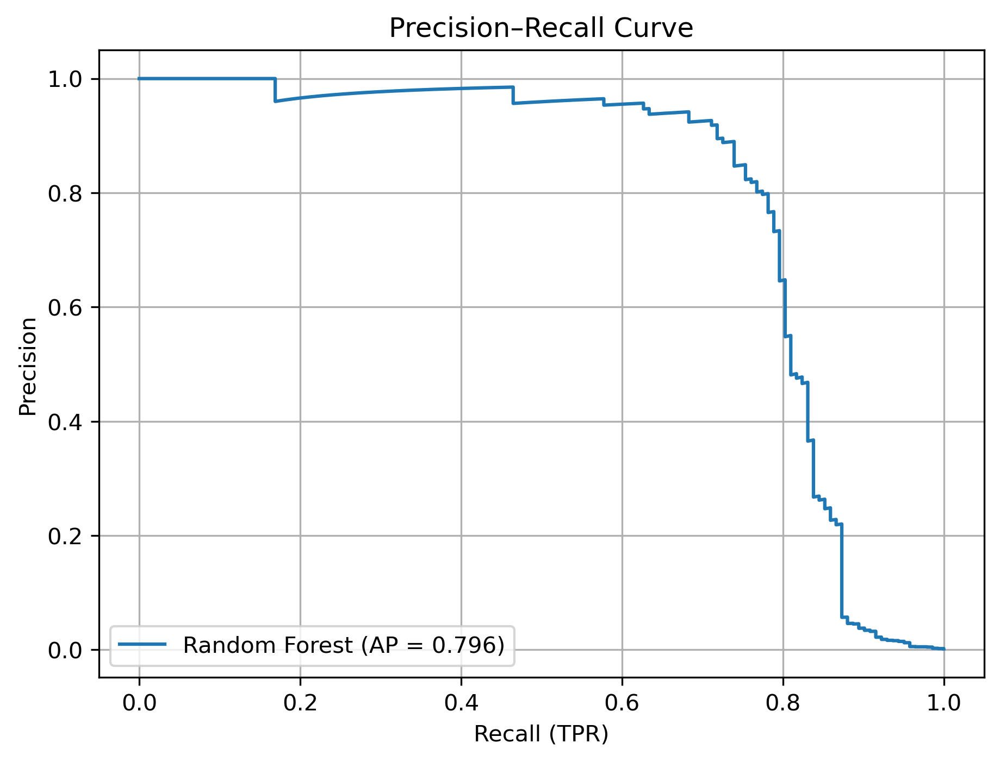
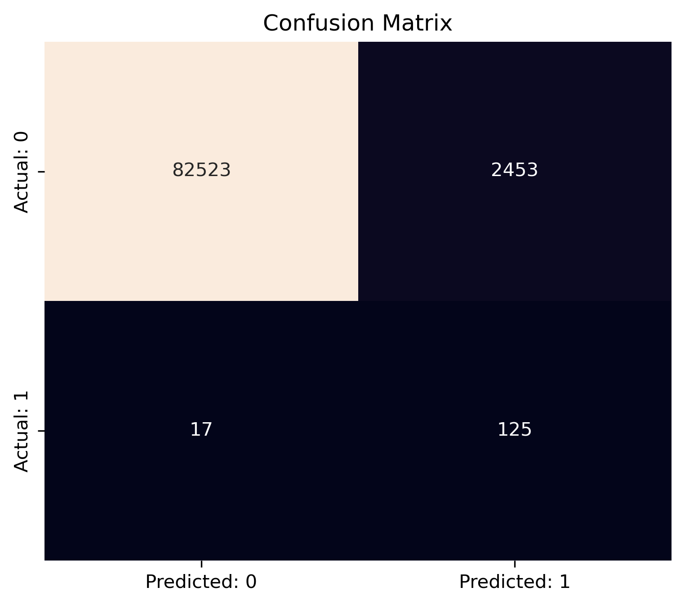

# 💳 Credit Card Fraud Detection — Machine Learning Project
### **By Vanshika Gupta**

---

## 📖 Project Overview

This project aims to detect fraudulent credit card transactions using machine learning.
The dataset is highly imbalanced (only ~0.17% fraud), which makes fraud detection challenging.

### We handle:

- Severe class imbalance
- Skewed transaction amounts
- PCA-transformed features (V1–V28)
- False-negative reduction (priority in fraud systems)

---

## 📂 Dataset Source

This project uses the publicly available Kaggle dataset:  
🔗 **Credit Card Fraud Detection Dataset**  
https://www.kaggle.com/datasets/mlg-ulb/creditcardfraud/data


### Dataset contains:

- 284,807 transactions
- 492 fraud cases
- 30 PCA-based features + Amount + Time

---

## 🧠 Business Problem

Fraudulent transactions cause major financial losses.
The main goal is to detect fraud early, focusing on:

- High Recall → catching most fraud cases
- Low False Negatives → avoid missing fraud
- Interpretability → features & importance
- Reliable model for real-time detection

---

## 📊 EDA Highlights

- Fraud cases are extremely rare → only 0.17%
- Amount feature is highly skewed → log transformation improves modeling
- Fraud transactions show behavioral patterns in time & amount
- PCA features cannot use VIF (no multicollinearity issue)

---

## 🔧 Machine Learning Pipeline

### **1. Data Preprocessing**
- Log transform → Amount_log
- Standard scaling (train only)
- SMOTE oversampling (train only)
- Stratified train-test split

### **2. Models Trained**
- Logistic Regression
- Random Forest Classifier (Final Selected Model)

### **3. Evaluation Metrics**
- Confusion Matrix
- Precision-Recall Curve
- ROC-AUC Curve
- Classification Report

---

## ✅ Final Model Selection

| Model	| Precision |	Recall	| F1 Score	| ROC-AUC |
|-------|-----------|---------|-----------|---------|
| **Logistic Regression**	| Moderate	| High	| Moderate	| ~0.96 |
| **Random Forest**	| High	| High	| Best	| 0.97+ |

🎯 **Random Forest selected as the final model**

---

## 📈 Model Visualizations

**ROC Curve**  


**Precision–Recall Curve**  


**Confusion Matrix**  


---

## 🗂 Model Artifacts

The Model/ folder contains:
- scaler.pkl → StandardScaler fitted on training data
- random_forest_model.pkl → Final Random Forest model

These can be reused for deployment or prediction on new data.

---

## 🤖 Sample Prediction Code

import joblib

scaler = joblib.load("Model/scaler.pkl")
model = joblib.load("Model/random_forest_model.pkl")

sample = [[...]]  # Your input features

scaled = scaler.transform(sample)
prediction = model.predict(scaled)
probability = model.predict_proba(scaled)

print("Prediction:", prediction)
print("Fraud Probability:", probability)

---

## 📌 Business Insights

- Fraud is highly imbalanced, requiring special handling
- Log-transformed Amount gives clearer fraud patterns
- PCA features still carry strong fraud signals
- Random Forest reduces the most false negatives
- The model is suitable for real-time fraud scoring

---

## 📝 Conclusion

- SMOTE & scaling applied only on training data → no leakage
- Random Forest provides the best trade-off between recall, precision, and AUC
- Model is suitable for real-world fraud detection systems
- Can be deployed using Flask/FastAPI or integrated with banking systems

---

## How to Run the Project

Install dependencies:

```
pip install -r requirements.txt
```

## Open the notebook:

[Credit_Card_Fraud_Detection.ipynb](Credit%20Card%20Fraud%20Detection.ipynb)

---

👩‍💻 Author

Vanshika Gupta

Data Scientist | Machine Learning | Python


